# Tecnológico de Software
## Materia: Arquitectura de software
- **Nombre:** Astrit Airan Cetzal Cetzal
- **Grupo:** A
- **Cuatrimestre:** Tercer Cuatrimestre
- **Carrera:** TSU en Desarrollo e Innovación de Software
- **Profesor:** Jorge Javier Pedrozo Romero

#  Catálogo de Álbumes de BTS

Un sistema web desarrollado para gestionar y visualizar una colección musical interactiva. Este proyecto fue creado como práctica académica para la materia de Arquitectura de Software, aplicando los fundamentos de la arquitectura Modelo-Vista-Controlador (MVC).

##  Descripción del Proyecto

El sistema permite visualizar un catálogo interactivo con la discografía de BTS. Los usuarios pueden explorar los álbumes, filtrar por tipo de lanzamiento (EP, Álbum de Estudio etc.) y acceder a una vista de detalles que muestra información técnica, descripción, portada y lista de canciones (tracklist). 

Además de ser un catálogo informativo, el sistema cuenta con características comunitarias: permite el registro de usuarios, inicio de sesión seguro y la posibilidad de que los usuarios dejen reseñas y calificaciones (rating de estrellas) en sus álbumes favoritos. Todo gestionado desde un panel interactivo que protege las rutas de creación para usuarios autenticados.

##  Cómo se construyó (Tecnologías)

Este proyecto fue desarrollado bajo la arquitectura **MVC** utilizando:

* **Backend:** C# con el framework ASP.NET Core MVC.
* **Frontend:** HTML5, CSS3 puro (Flexbox, Grid, Animaciones).
* **Autenticación:** ASP.NET Core Authentication (Cookies).
* **Almacenamiento (Persistencia de Datos):** Sistema de archivos JSON locales (`users.json`, `reviews.json`, `items.json`). Los datos se escriben y leen dinámicamente mediante el patrón Repositorio, eliminando la necesidad de una base de datos relacional para este entorno de pruebas. El manejo de imágenes se realiza mediante conversiones temporales a cadenas **Base64**.

## Funcionalidades Implementadas

1. **Lectura de Catálogo (Read):** Visualización en formato cuadrícula de la discografía con efectos de animación CSS.
2. **Filtros Dinámicos:** Clasificación de los elementos en tiempo real según su categoría.
3. **Sistema de Usuarios y Autenticación:** Registro de cuentas e inicio de sesión mediante Cookies, permitiendo personalizar la experiencia del usuario (ej. menú dinámico).
4. **Seguridad y Control de Acceso:** Uso de etiquetas `[Authorize]` para proteger los formularios de creación y asegurar que solo los usuarios registrados puedan agregar contenido o dejar comentarios.
5. **Sistema de Reseñas:** Capacidad de dejar comentarios y otorgar una calificación visual (1 a 5 estrellas) por álbum, con cálculo de promedio dinámico.
6. **Procesamiento de Archivos Multmedia (IFormFile):** Conversión de imágenes de portada y tracklist subidas por el usuario a Base64 para su almacenamiento directo.

## 📸 Capturas de Pantalla

**Página Principal (Inicio)**
### Se puede acceder al catalogo dando clic a "Catalogo" en el menú o dando clic en "Explorar catálogo" ambas son posibles
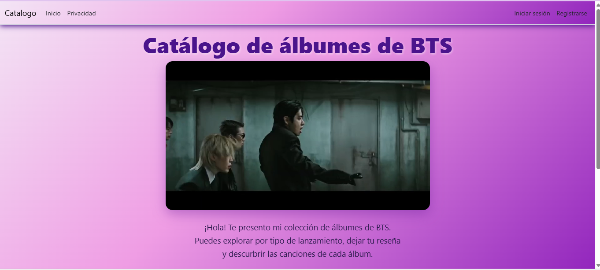
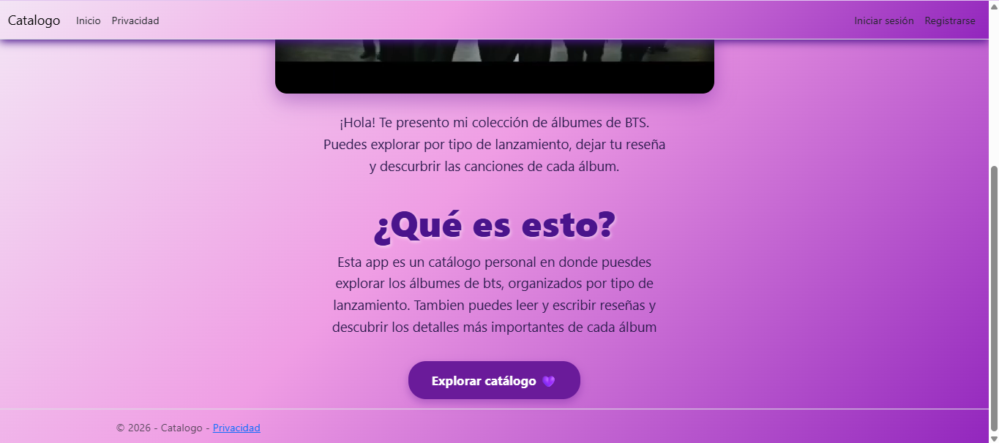

**Catálogo y Filtros**
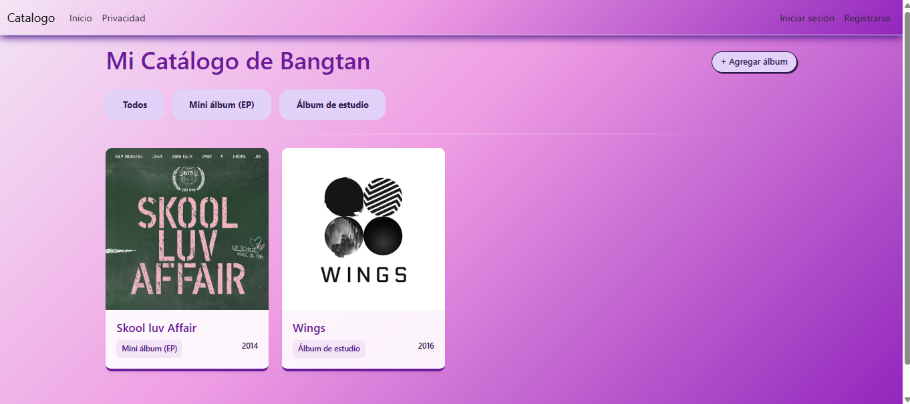
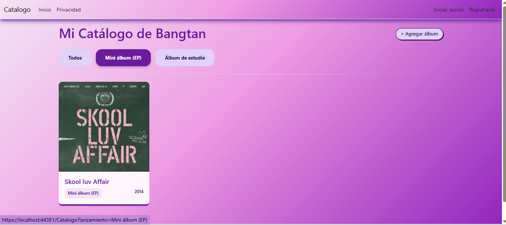
### Aqui agregué un álbum más
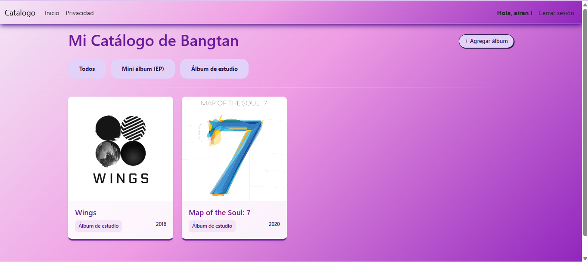

**Registro e inicio de sesión**
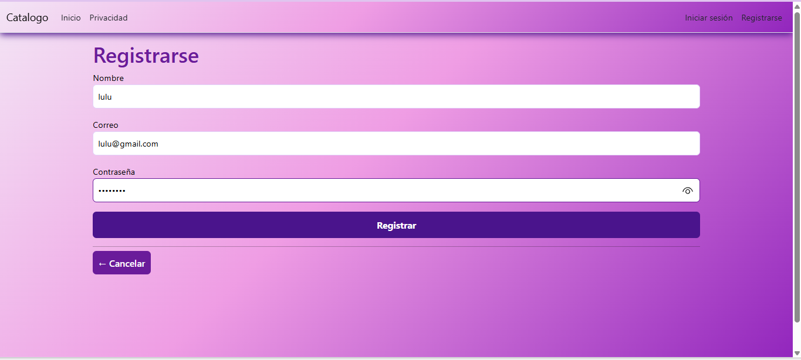
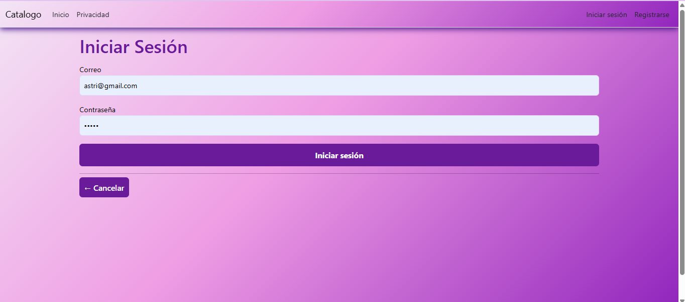

**Vista de Detalles y Reseñas**
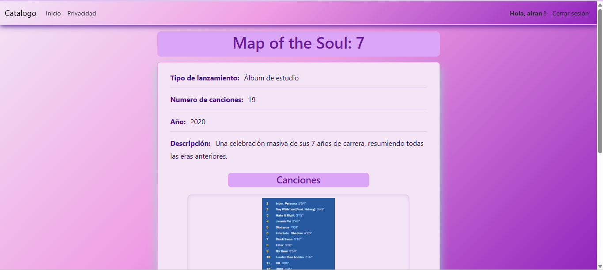
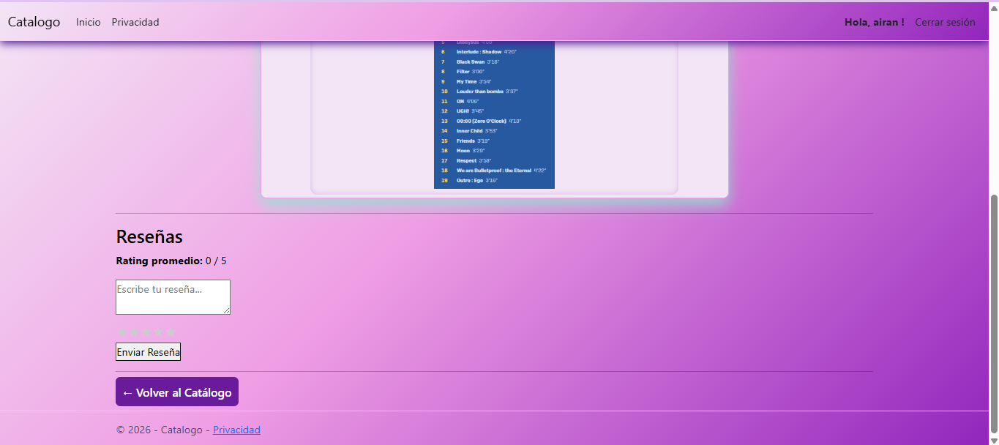
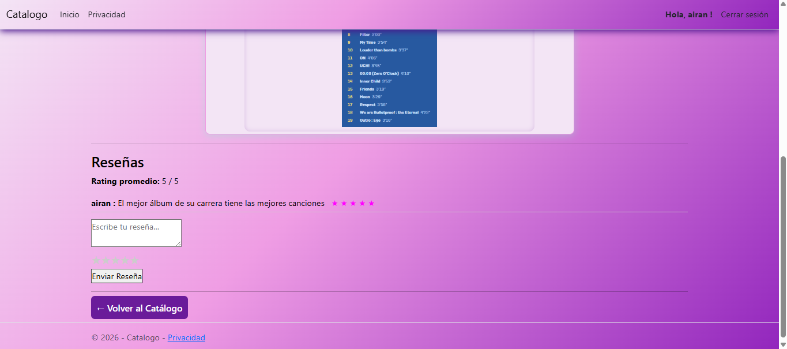
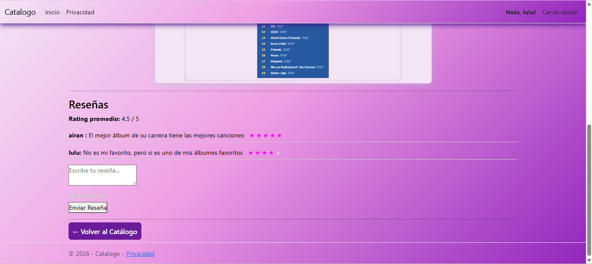

**Formulario de Agregar Álbum**
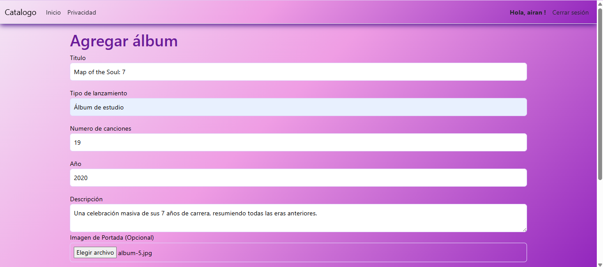
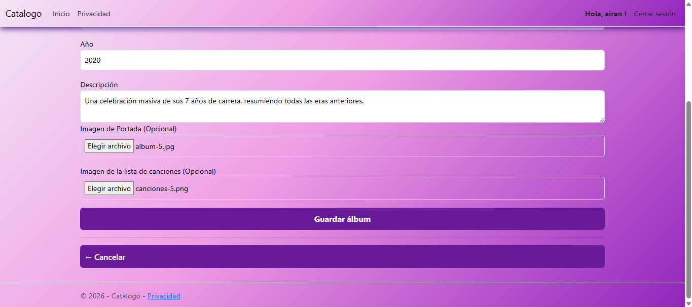

**Privacidad**
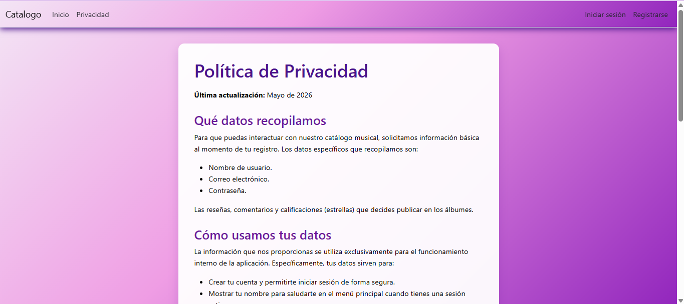
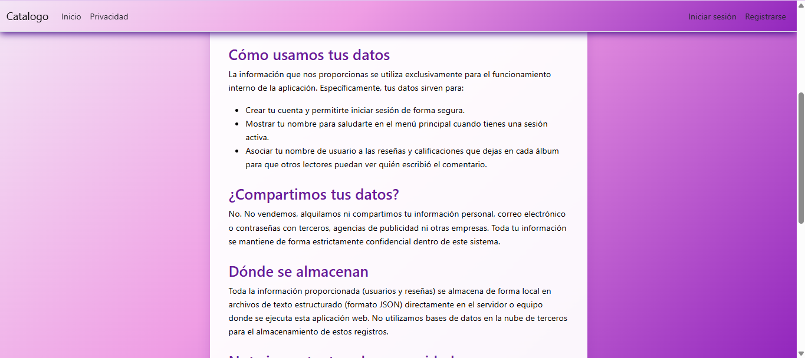
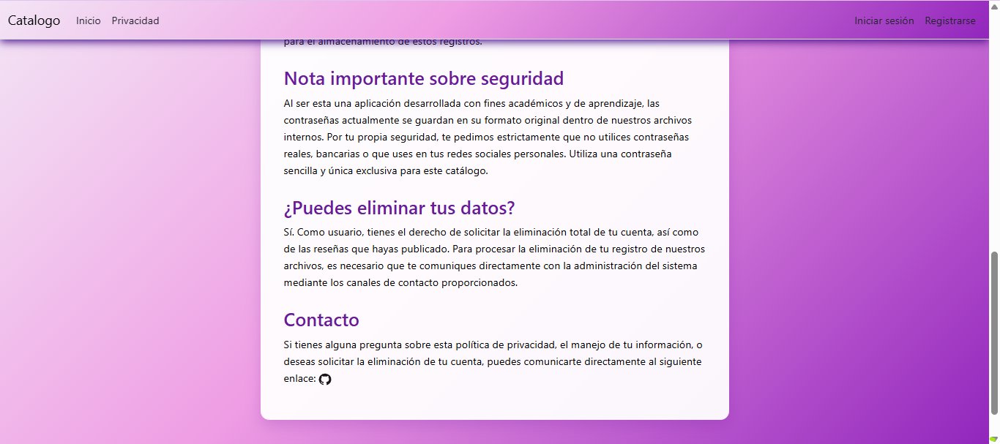

---

## Declaración de uso de uso de 

Para el desarrollo de este proyecto declaro que utilicé asistencia de modelos de Inteligencia Artificial (LLMs) como herramienta de apoyo educativo bajo los siguientes propósitos:
* **Depuración (Debugging):** Análisis de errores de compilación, inyección de dependencias y problemas de enrutamiento en ASP.NET Core.
* **Diseño UI/UX:** Ayuda para la generación de estructuras de estilo CSS avanzadas y personalización visual (ej. sistema de estrellas con botones de radio).
* **Refactorización y Lógica:** Orientación sobre mejores prácticas para la lectura/escritura de archivos JSON y la implementación del flujo de Autenticación por Cookies.

El diseño lógico, la arquitectura, la estructuración de los modelos/controladores y la validación final del código fueron realizados por mí (Astrit Cetzal).

## Agradecimientos

- **Profesor Jorge Javier Pedrozo Romero** por el apoyo constante y la guía durante el desarrollo de la materia.

---
## Contacto

- **Email Institucional:** [astrit.cetzal@tecdesoftware.edu.mx]
- **GitHub:** [astritcetzal](https://github.com/astritcetzal)
  
---

## Derechos de Autor (Copyright)

Copyright (c) 2026 Astrit. Todos los derechos reservados.

Este proyecto y su código fuente fueron desarrollados de manera individual con fines académicos. No se autoriza la copia, reproducción, distribución, modificación o reutilización total ni parcial de este código sin el consentimiento expreso y por escrito de la autora.

---

**⭐ Si te gustó este proyecto, dale una estrella ⭐**

Hecho con 💗 por **Astrit Cetzal** - 2026

